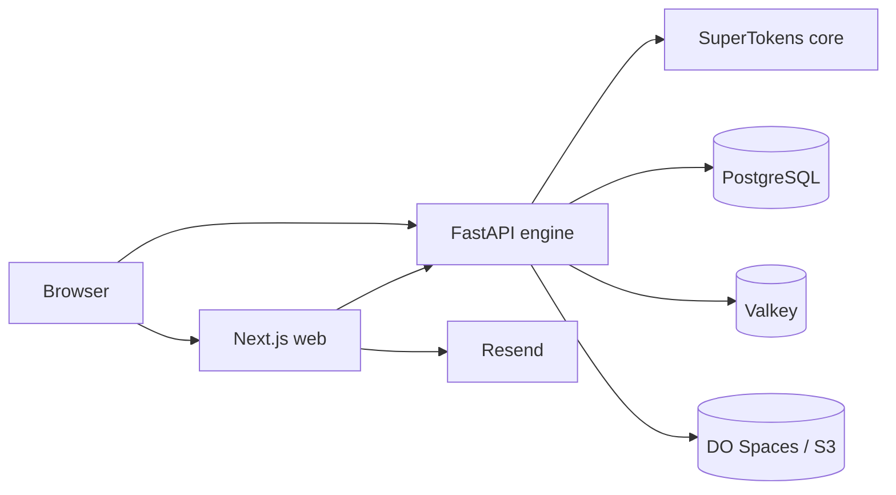

# MovieShakerV2

MovieShaker is a film production management platform that helps teams run projects end-to-end: projects, scripts, budgeting, scheduling, crew workflows, and supporting production operations.

This repository contains the Next.js frontend and the FastAPI backend, plus local infrastructure for auth and database services.

## Architecture

- `web/` - Next.js 16 app (React 19, App Router)
- `engine/` - FastAPI service (business APIs)
- `docker-compose.yml` - local orchestration for API, auth, database, cache, and proxy
- `caddy/` - reverse proxy config for `api.movieshaker.com`
- `init-scripts/` - database initialization scripts

### Service interaction



## Prerequisites

- Docker Desktop (or Docker Engine + Compose plugin)
- Node.js 20.x (for frontend local build/dev)
- Python 3.11+ (only needed for backend tests outside containers)

## Quick start (full stack, recommended)

From the repository root:

```bash
docker compose up -d --build
```

Local endpoints:

- Web: `http://localhost:3000`
- Engine API: `http://localhost:8000`
- SuperTokens: `http://localhost:3567`
- Health check: `http://localhost:8000/health`

## Run frontend only

Use this when working only on UI and routing:

```bash
cd web
npm install
npm run dev
```

Then open `http://localhost:3000`.

If Docker services are already running and you want a single reliable command for web startup/logs:

```bash
./dev-web.sh
```

## Run backend only (without compose web service)

```bash
docker compose up -d db supertokens valkey engine
```

The API will be available at `http://localhost:8000`.

## Environment variables

Copy `.env.example` to `.env` at repo root, then set values for your environment.

### Core backend/auth variables

- `API_BASE_URL` - external API origin (example: `https://api.movieshaker.com`)
- `WEBSITE_DOMAIN` - external web origin (example: `https://movieshaker.com`)
- `CORS_ORIGINS` - optional extra allowed origins (comma-separated)
- `SUPERTOKENS_CONNECTION_URI` - SuperTokens core URI
- `DATABASE_URL` - engine DB URL

### Storage/email variables

- `DO_SPACES_ENDPOINT`
- `DO_SPACES_REGION`
- `DO_SPACES_BUCKET`
- `DO_SPACES_ACCESS_KEY_ID`
- `DO_SPACES_SECRET_ACCESS_KEY`
- `RESEND_API_KEY` (web email route)
- `INTERNAL_API_KEY` (shared secret engine <-> web internal email route)

### Frontend variables (`web/.env.local`)

- `NEXT_PUBLIC_API_URL` (example: `http://localhost:8000`)
- `NEXT_PUBLIC_WEBSITE_DOMAIN` (example: `http://localhost:3000`)

## Testing

Backend tests:

```bash
pip install -r engine/requirements.txt
pytest engine/tests -q
```

## Production notes

- Keep `API_BASE_URL` and `WEBSITE_DOMAIN` set explicitly in production.
- CORS defaults include key production domains, and `CORS_ORIGINS` can append additional origins.
- For auth refresh issues, validate preflight:

```bash
curl -i -X OPTIONS "https://api.movieshaker.com/auth/session/refresh" \
  -H "Origin: https://movieshaker.com" \
  -H "Access-Control-Request-Method: POST"
```

## Common troubleshooting

- **Node version issues**: use Node 20 (`nvm use 20`) for `web` dev/build.
- **CORS/session refresh failures**:
  - verify `API_BASE_URL`, `WEBSITE_DOMAIN`, and `CORS_ORIGINS`
  - redeploy/restart engine after env changes
- **Stuck git operations in Cursor**:
  - stop queued git jobs in the IDE terminal queue
  - retry commit/push
